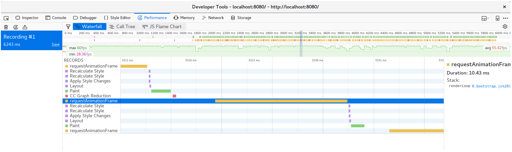

# 時間分析

この章では、ライフゲームの実装のパフォーマンスを向上させます。
時間分析を使用して、取り組みをガイドします。

続行する前に、[RustおよびWebAssemblyコードの時間プロファイリングに使用できるツール](../reference/time-profiling.md)をよく理解してください。

## `window.performance.now`関数を使用した1秒あたりのフレーム数タイマーの作成

FPSタイマーは、ライフゲームのレンダリングの高速化を調査するときに役立ちます。

まず、 `fps`オブジェクトを`wasm-game-of-life/www/index.js`に追加します。

```js
const fps = new class {
  constructor() {
    this.fps = document.getElementById("fps");
    this.frames = [];
    this.lastFrameTimeStamp = performance.now();
  }

  render() {
    // Convert the delta time since the last frame render into a measure
    // of frames per second.
    const now = performance.now();
    const delta = now - this.lastFrameTimeStamp;
    this.lastFrameTimeStamp = now;
    const fps = 1 / delta * 1000;

    // Save only the latest 100 timings.
    this.frames.push(fps);
    if (this.frames.length > 100) {
      this.frames.shift();
    }

    // Find the max, min, and mean of our 100 latest timings.
    let min = Infinity;
    let max = -Infinity;
    let sum = 0;
    for (let i = 0; i < this.frames.length; i++) {
      sum += this.frames[i];
      min = Math.min(this.frames[i], min);
      max = Math.max(this.frames[i], max);
    }
    let mean = sum / this.frames.length;

    // Render the statistics.
    this.fps.textContent = `
Frames per Second:
         latest = ${Math.round(fps)}
avg of last 100 = ${Math.round(mean)}
min of last 100 = ${Math.round(min)}
max of last 100 = ${Math.round(max)}
`.trim();
  }
};
```

次に、 `renderLoop`の各反復で`fps``render`関数を呼び出します。

```js
const renderLoop = () => {
    fps.render(); //new

    universe.tick();
    drawGrid();
    drawCells();

    animationId = requestAnimationFrame(renderLoop);
};
```

最後に、 `<canvas>`のすぐ上にある `wasm-game-of-life/www/index.html`に`fps`要素を追加することを忘れないでください。

```html
<div id="fps"></div>
```

そして、CSSを追加して、フォーマットを適切にします。

```css
#fps {
  white-space: pre;
  font-family: monospace;
}
```

そして出来上がり！ [http://localhost:8080](http://localhost:8080)を更新すると、FPSカウンターができました。

[perf-now]: https://developer.mozilla.org/en-US/docs/Web/API/Performance/now

### `Universe :: tick`と` console.time`および `console.timeEnd`の時間を測定する

`Universe::tick`の各呼び出しにかかる時間を測定するには、`web-sys`クレートを介して `console.time`と`console.timeEnd`を使用できます。

まず、 `wasm-game-of-life/Cargo.toml`への依存関係として`web-sys`を追加します。

```toml
[dependencies.web-sys]
version = "0.3"
features = [
  "console",
]
```

すべての `console.time`呼び出しに対応する`console.timeEnd`呼び出しがあるはずなので、両方を[RAII][]タイプにまとめると便利です。

```rust
extern crate web_sys;
use web_sys::console;

pub struct Timer<'a> {
    name: &'a str,
}

impl<'a> Timer<'a> {
    pub fn new(name: &'a str) -> Timer<'a> {
        console::time_with_label(name);
        Timer { name }
    }
}

impl<'a> Drop for Timer<'a> {
    fn drop(&mut self) {
        console::time_end_with_label(self.name);
    }
}
```

次に、このスニペットをメソッドの先頭に追加することで、各 `Universe::tick`にかかる時間を測定することができます。

```rust
let _timer = Timer::new("Universe::tick");
```

`Universe::tick`への各呼び出しにかかった時間がコンソールに記録されるようになりました。

[](../images/game-of-life/console-time.png)

さらに、 `console.time`と`console.timeEnd`のペアが、ブラウザのプロファイラーの「タイムライン」または「ウォーターフォール」ビューに表示されます。

[](../images/game-of-life/console-time-in-profiler.png)

[RAII]: https://en.wikipedia.org/wiki/Resource_acquisition_is_initialization

## ライフゲームの宇宙の成長

> ⚠️このセクションでは、Firefoxのスクリーンショットの例を利用します。
> 最近のすべてのブラウザーには同様のツールがありますが、異なる開発者ツールを使用する場合は微妙な違いがあるかもしれません。
> 抽出するプロファイル情報は基本的に同じですが、表示されるビューやさまざまなツールの名前によって、マイレージが異なる場合があります。

ライフゲームの世界を大きくするとどうなりますか？ 64x64ユニバースを128x128ユニバースに置き換えると(`wasm-game-of-life/src/lib.rs`の`Universe::new`を変更することにより)、私のマシンでは、FPSがスムーズな60から途切れ途切れの40に低下します。

プロファイルを記録してウォーターフォールビューを見ると、各アニメーションフレームに20ミリ秒以上かかっていることがわかります。
1秒あたり60フレームは、フレームをレンダリングするプロセス全体で16ミリ秒を残すことを思い出してください。
これは、JavaScriptとWebAssemblyだけでなく、描画など、ブラウザーが実行しているすべてのことでもあります。

[](../images/game-of-life/drawCells-before-waterfall.png)

単一のアニメーションフレーム内で何が起こるかを見ると、`CanvasRenderingContext2D.fillStyle`セッターは非常に高価であることがわかります。

> ⚠️Firefoxで、上記の`CanvasRenderingContext2D.fillStyle`の代わりに「DOM」とだけ書かれた行が表示された場合は、
> パフォーマンス開発ツールのオプションで「Geckoプラットフォームデータを表示する」オプションをオンにする必要があります。
>
> [](../images/game-of-life/profiler-firefox-show-gecko-platform.png)

[](../images/game-of-life/drawCells-before-flamegraph.png)

そして、コールツリーの多くのフレームの集約を調べることで、これが異常ではないことを確認できます。

[](../images/game-of-life/drawCells-before-calltree.png)

時間のほぼ40％がこのセッターに費やされています！

> ⚡`tick`メソッドの何かがパフォーマンスのボトルネックになると予想していたかもしれませんが、そうではありませんでした。
> 予想外の場所で時間が費やされる可能性があるため、常にプロファイリングに焦点を合わせてください。

`wasm-game-of-life/www/index.js`の`drawCells`関数では、 `fillStyle`プロパティは、すべてのアニメーションフレームで、ユニバースのすべてのセルに1回設定されます。

```js
for (let row = 0; row < height; row++) {
  for (let col = 0; col < width; col++) {
    const idx = getIndex(row, col);

    ctx.fillStyle = cells[idx] === DEAD
      ? DEAD_COLOR
      : ALIVE_COLOR;

    ctx.fillRect(
      col * (CELL_SIZE + 1) + 1,
      row * (CELL_SIZE + 1) + 1,
      CELL_SIZE,
      CELL_SIZE
    );
  }
}
```

`fillStyle`の設定は非常に費用がかかることがわかったので、頻繁に設定しないようにするにはどうすればよいでしょうか。
セルが死活に応じて、`fillStyle`を変更する必要があります。
`fillStyle = ALIVE_COLOR`を設定してから、1回のパスですべての活性セルを描画し、次に`fillStyle = DEAD_COLOR`を設定して、別のパスですべての非活性セルを描画すると、 `fillStyle`の設定は、セル毎ではなく2回だけ終了します。

```js
// Alive cells.
ctx.fillStyle = ALIVE_COLOR;
for (let row = 0; row < height; row++) {
  for (let col = 0; col < width; col++) {
    const idx = getIndex(row, col);
    if (cells[idx] !== Cell.Alive) {
      continue;
    }

    ctx.fillRect(
      col * (CELL_SIZE + 1) + 1,
      row * (CELL_SIZE + 1) + 1,
      CELL_SIZE,
      CELL_SIZE
    );
  }
}

// Dead cells.
ctx.fillStyle = DEAD_COLOR;
for (let row = 0; row < height; row++) {
  for (let col = 0; col < width; col++) {
    const idx = getIndex(row, col);
    if (cells[idx] !== Cell.Dead) {
      continue;
    }

    ctx.fillRect(
      col * (CELL_SIZE + 1) + 1,
      row * (CELL_SIZE + 1) + 1,
      CELL_SIZE,
      CELL_SIZE
    );
  }
}
```

これらの変更を保存して[http://localhost:8080/](http://localhost:8080/)を更新すると、レンダリングはスムーズな60フレーム/秒に戻ります。

別のプロファイルを取得すると、各アニメーションフレームで約10ミリ秒しか費やされていないことがわかります。

[](../images/game-of-life/drawCells-after-waterfall.png)

1つのフレームを分解すると、 `fillStyle`のコストがなくなり、フレームの時間のほとんどが` fillRect`内で費やされ、各セルの長方形が描画されていることがわかります。

[](../images/game-of-life/drawCells-after-flamegraph.png)

### 訳者の環境では・・・
> 訳者の環境では、この方法では速度に変化はありませんでした。
>
> 代案として、<br/>
> `drawCells`で領域を非活性のセル色で塗りつぶす様に修正し、`drawGrid`で、活性セルのみ描画するように変更。<br/>
> これにより、ほぼ、目標のフレーム数を達成しました。
>
> 更にセルの数を増やした場合、<br/>
> 活性セルの`fillRect`がネックになります。<br/>
> 更にセルの数を増やすと、`tick` - 次の世代の計算がネックになります。

> 活性セルの`fillRect`については、`WebGL`などのより高速な描画に置き換えることと<br/>
> 次世代の計算を複数回行った後に表示するといった表示の間引き？や<br/>
> 表示領域を指定する<br/>
> などの工夫が必要そうです。
>
> `tick`については、活性セルが少ないのであれば、非活性のセルを計算対象にしない方策を取る必要があります。<br/>
> 活性セルが多い場合の対策は思い浮かびません。


## 速くする

一部の人々は、待つのが好きではなく、アニメーションフレームごとに宇宙の1ステップが発生するのではなく、9ステップが発生したほうがよいと考えています。
`wasm-game-of-life/www/index.js`の`renderLoop`関数を変更して、これを非常に簡単に行うことができます。

```js
for (let i = 0; i < 9; i++) {
  universe.tick();
}
```

私のマシンでは、これにより1秒あたりわずか35フレームに戻ります。
ダメ。60フレームにしたい！

`Universe::tick`に時間が費やされていることがわかったので、`Timer`をいくつか追加して `console.time`と`console.timeEnd`の呼び出しでそのさまざまなビットをラップし、それがどこにつながるかを見てみましょう。
セルの新しいベクトルを割り当て、すべてのステップで古いベクトルを解放することはコストがかかり、時間予算のかなりの部分を占めるということのが私の仮説です。

```rust
pub fn tick(&mut self) {
    let _timer = Timer::new("Universe::tick");

    let mut next = {
        let _timer = Timer::new("allocate next cells");
        self.cells.clone()
    };

    {
        let _timer = Timer::new("new generation");
        for row in 0..self.height {
            for col in 0..self.width {
                let idx = self.get_index(row, col);
                let cell = self.cells[idx];
                let live_neighbors = self.live_neighbor_count(row, col);

                let next_cell = match (cell, live_neighbors) {
                    // Rule 1: Any live cell with fewer than two live neighbours
                    // dies, as if caused by underpopulation.
                    (Cell::Alive, x) if x < 2 => Cell::Dead,
                    // Rule 2: Any live cell with two or three live neighbours
                    // lives on to the next generation.
                    (Cell::Alive, 2) | (Cell::Alive, 3) => Cell::Alive,
                    // Rule 3: Any live cell with more than three live
                    // neighbours dies, as if by overpopulation.
                    (Cell::Alive, x) if x > 3 => Cell::Dead,
                    // Rule 4: Any dead cell with exactly three live neighbours
                    // becomes a live cell, as if by reproduction.
                    (Cell::Dead, 3) => Cell::Alive,
                    // All other cells remain in the same state.
                    (otherwise, _) => otherwise,
                };

                next[idx] = next_cell;
            }
        }
    }

    let _timer = Timer::new("free old cells");
    self.cells = next;
}
```

タイミングを見ると、私の仮説が間違っていることは明らかです。
時間の大部分は、実際に次世代のセルを計算するために費やされています。
驚くべきことに、すべてのステップにベクトルを割り当てて解放することは、ごくわずかなコストであるように見えます。
常に行うもう一つのリマインダーは、プロファイリングの努力で導く！

[](../images/game-of-life/console-time-in-universe-tick.png)

次のセクションでは、`nightly`コンパイラが必要です。
ベンチマークに使用する[テスト機能ゲート](https://doc.rust-lang.org/unstable-book/library-features/test.html)のために必要です。
インストールするもう1つのツールは[cargobenchcmp][benchcmp]です。
これは、`cargo bench`によって生成されたマイクロベンチマークを比較するための小さなユーティリティです。

[benchcmp]: https://github.com/BurntSushi/cargo-benchcmp

WebAssemblyが実行しているのと同じことを実行するネイティブコード `#[bench]`を記述しましょう。
ただし、より成熟したプロファイリングツールを使用できます。
新しい `wasm-game-of-life/Benches/bench.rs`は次のとおりです。

```rust
#![feature(test)]

extern crate test;
extern crate wasm_game_of_life;

#[bench]
fn universe_ticks(b: &mut test::Bencher) {
    let mut universe = wasm_game_of_life::Universe::new();

    b.iter(|| {
        universe.tick();
    });
}
```

また、すべての `#[wasm_bindgen]`アノテーションをコメントアウトする必要があります。
そうしないと、 `Cargo.toml`の`"cdylib"`ビットが失敗し、ネイティブコードのビルドに失敗してリンクエラーが発生します。

これらすべてが整ったら、 `cargo bench | tee before.txt`でコンパイルして、ベンチマークを実行します。
 `| tee before.txt`の部分は、 `cargo Bench`から出力を取得し、`before.txt`というファイルに入れます。

```
$ cargo bench | tee before.txt
    Finished release [optimized + debuginfo] target(s) in 0.0 secs
     Running target/release/deps/wasm_game_of_life-91574dfbe2b5a124

running 0 tests

test result: ok. 0 passed; 0 failed; 0 ignored; 0 measured; 0 filtered out

     Running target/release/deps/bench-8474091a05cfa2d9

running 1 test
test universe_ticks ... bench:     664,421 ns/iter (+/- 51,926)

test result: ok. 0 passed; 0 failed; 0 ignored; 1 measured; 0 filtered out
```

これにより、バイナリがどこにあるかもわかり、ベンチマークを再度実行できますが、
今回はオペレーティングシステムのプロファイラーの下で実行します。
私の場合、Linuxを実行しているので、[`perf`][perf]が使用するプロファイラーです。

[perf]: https://perf.wiki.kernel.org/index.php/Main_Page

```
$ perf record -g target/release/deps/bench-8474091a05cfa2d9 --bench
running 1 test
test universe_ticks ... bench:     635,061 ns/iter (+/- 38,764)

test result: ok. 0 passed; 0 failed; 0 ignored; 1 measured; 0 filtered out

[ perf record: Woken up 1 times to write data ]
[ perf record: Captured and wrote 0.178 MB perf.data (2349 samples) ]
```

`perf report`を使用してプロファイルをロードすると、予想どおり、すべての時間が`Universe::tick`に費やされていることがわかります。

[](../images/game-of-life/bench-perf-report.png)

`perf`は、`a`を押すと、関数時間内のどの命令が費やされているかを注釈します。

[](../images/game-of-life/bench-perf-annotate.png)

これは、時間の26.67％が隣接セルの値の合計に費やされ、23.41％が隣接セルの列インデックスの取得に費やされ、
さらに15.42％が隣接セルの行インデックスの取得に費やされていることを示しています。
これらの上位3つの最も高価な命令のうち、2番目と3番目は両方とも高価な「div」命令です。
これらの `div`は、`Universe::live_neighbor_count`のモジュロインデックスロジックを実装します。

`wasm-game-of-life/src/lib.rs`内の`live_neighbor_count`定義を思い出してください。

```rust
fn live_neighbor_count(&self, row: u32, column: u32) -> u8 {
    let mut count = 0;
    for delta_row in [self.height - 1, 0, 1].iter().cloned() {
        for delta_col in [self.width - 1, 0, 1].iter().cloned() {
            if delta_row == 0 && delta_col == 0 {
                continue;
            }

            let neighbor_row = (row + delta_row) % self.height;
            let neighbor_col = (column + delta_col) % self.width;
            let idx = self.get_index(neighbor_row, neighbor_col);
            count += self.cells[idx] as u8;
        }
    }
    count
}
```

モジュロを使用した理由は、最初または最後の行または列のエッジの場合に`if`ブランチでコードが乱雑にならないようにするためです。
しかし、`row`も`column`も宇宙の端になく、モジュロラッピング処理を必要としない最も一般的なケースでも、`div`命令のコストを支払っています。
代わりに、エッジケースに`if`を使用してこのループを展開する場合、分岐はCPUの分岐予測子によって非常によく予測されるはずです。

`live_neighbor_count`を次のように書き直してみましょう。

```rust
fn live_neighbor_count(&self, row: u32, column: u32) -> u8 {
    let mut count = 0;

    let north = if row == 0 {
        self.height - 1
    } else {
        row - 1
    };

    let south = if row == self.height - 1 {
        0
    } else {
        row + 1
    };

    let west = if column == 0 {
        self.width - 1
    } else {
        column - 1
    };

    let east = if column == self.width - 1 {
        0
    } else {
        column + 1
    };

    let nw = self.get_index(north, west);
    count += self.cells[nw] as u8;

    let n = self.get_index(north, column);
    count += self.cells[n] as u8;

    let ne = self.get_index(north, east);
    count += self.cells[ne] as u8;

    let w = self.get_index(row, west);
    count += self.cells[w] as u8;

    let e = self.get_index(row, east);
    count += self.cells[e] as u8;

    let sw = self.get_index(south, west);
    count += self.cells[sw] as u8;

    let s = self.get_index(south, column);
    count += self.cells[s] as u8;

    let se = self.get_index(south, east);
    count += self.cells[se] as u8;

    count
}
```

では、ベンチマークをもう一度実行してみましょう。 今回は `after.txt`に出力します。

```
$ cargo bench | tee after.txt
   Compiling wasm_game_of_life v0.1.0 (file:///home/fitzgen/wasm_game_of_life)
    Finished release [optimized + debuginfo] target(s) in 0.82 secs
     Running target/release/deps/wasm_game_of_life-91574dfbe2b5a124

running 0 tests

test result: ok. 0 passed; 0 failed; 0 ignored; 0 measured; 0 filtered out

     Running target/release/deps/bench-8474091a05cfa2d9

running 1 test
test universe_ticks ... bench:      87,258 ns/iter (+/- 14,632)

test result: ok. 0 passed; 0 failed; 0 ignored; 1 measured; 0 filtered out
```

それはずっと良く見えます！ `benchcmp`ツールと以前に作成した2つのテキストファイルを使用すると、どれだけ優れているかがわかります。

```
$ cargo benchcmp before.txt after.txt
 name            before.txt ns/iter  after.txt ns/iter  diff ns/iter   diff %  speedup
 universe_ticks  664,421             87,258                 -577,163  -86.87%   x 7.61
```

なんと、7.61倍スピードアップ！

WebAssemblyは意図的に一般的なハードウェアアーキテクチャに密接にマッピングされていますが、このネイティブコードの高速化がWebAssemblyの高速化にもつながることを確認する必要があります。

`.wasm`を`wasm-pack build`で再構築し、[http://localhost:8080/](http://localhost:8080/)を更新しましょう。
私のマシンでは、ページは再び60フレーム/秒で実行されており、ブラウザーのプロファイラーで別のプロファイルを記録すると、各アニメーションフレームに約10ミリ秒かかることがわかります。

成功！

[](../images/game-of-life/waterfall-after-branches-and-unrolling.png)

## 演習

* この時点で、 `Universe::tick`を高速化するための次に低い成果は、割り当てを削除して解放することです。
  セルのダブルバッファリングを実装せよ。
  ここで、 `Universe`は2つのベクトルを維持し、どちらも解放せず、`tick`に新しいバッファを割り当てません。

* 「Implementing Life」の章の代替のデルタベースの設計を実装します。
  ここでは、Rustコードが状態をJavaScriptに変更したセルのリストを返します。
  これにより、`<canvas>`へのレンダリングが速くなりますか？
  ステップごとにデルタの新しいリストを割り当てることなく、この設計を実装できますか？

* 私たちのプロファイリングが示しているように、2D `<canvas>`レンダリングは特に高速ではありません。
  2Dキャンバスレンダラーを[WebGL][webgl]レンダラーに置き換えよ。
  WebGLバージョンはどれくらい高速ですか？
  WebGLレンダリングがボトルネックになる前に、宇宙をどのくらい大きくすることができますか？

[webgl]: https://developer.mozilla.org/en-US/docs/Web/API/WebGL_API
